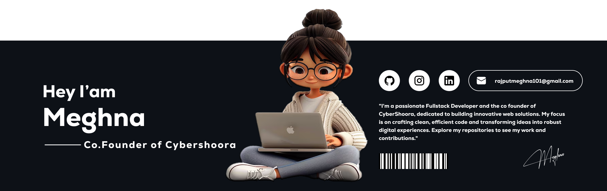

# Hello World!, I'm Meghna, an Indian Developer 👋🏼:

<!--  -->

# 💫 About Me:
 👋 Hi there! I'm a motivated <b>MCA student at Vellore Institute of Technology, Vellore</b> with a strong interest in <b>Full Stack Development and Data Analytics</b> 🚀. I enjoy building modern web applications and working with data to generate meaningful insights that solve real-world problems 💻.  

💡 I am proficient in technologies such as <b>JavaScript, React.js, Next.js, Node.js, Python, SQL, and Power BI</b>. I have hands-on experience in developing scalable web applications and creating data-driven dashboards for analysis and decision making 📊.  

🚀 I enjoy working on innovative projects that combine development and intelligent systems. Currently, I am working on an <b>AI-based Crowd Risk Prediction research project</b> that uses <b>Computer Vision and Deep Learning</b> to analyze crowd behavior and predict potential risk situations 🤖.  

🔧 <b>Technical Skills</b> 
Languages: JavaScript, Python, SQL 
Frontend: React.js, Next.js, HTML, CSS 
Backend: Node.js, Express.js 
Data & Analytics: Power BI, Data Analysis 
Tools: GitHub, Figma  

🎯 I am actively seeking opportunities to apply my technical knowledge, gain industry experience, and contribute to building innovative technology solutions in a collaborative environment.  

🤝 Feel free to explore my repositories to see my projects and work. I'm always excited to learn, build, and collaborate on impactful technology solutions! ✨   

